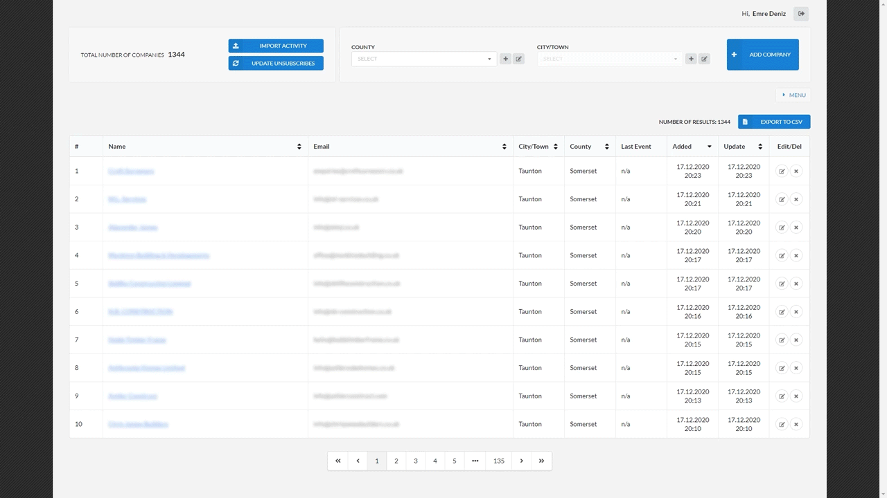

## FRONTEND

Frontend is developed with React Hooks + Context API and Modular SCSS. Direct to `/register` to initialize a user account.

**To run the application:**

    cd client
    yarn    
    yarn start

**To run the tests over few main features:**

    yarn test  

## Some shots from the app:

``The companies list may include newly added companies which won't have email activity records. Companies may be exported due to selection of different filters. "Global Unsubscribers" and "Unsubscribers in Latest Events" differs. You may click anytime to Update Global Unsubscribers to from Sendgrid API and all companies will be updated. Unsubscribes showing up in Latest Events are the ones that were captured in Free Plan``

 
 

``When using Sendgrid Marketing Singlesends on web, you can download email activity reports (Free Plan) and import into app. To import and process a report, you follow the steps as the application leads like below. Before importing the application you need to click Refresh send button which will update the list from Sendgrid API which will be updated after each singlesend.``

 
 

``Shots of CRUD operations for companies list``

 
 

